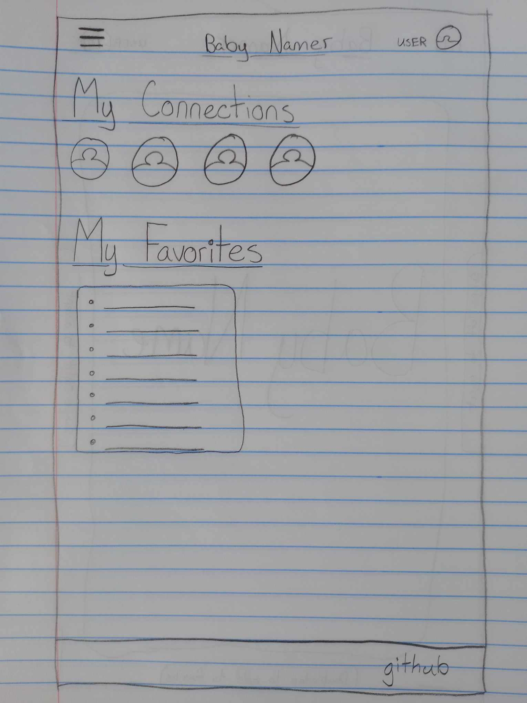
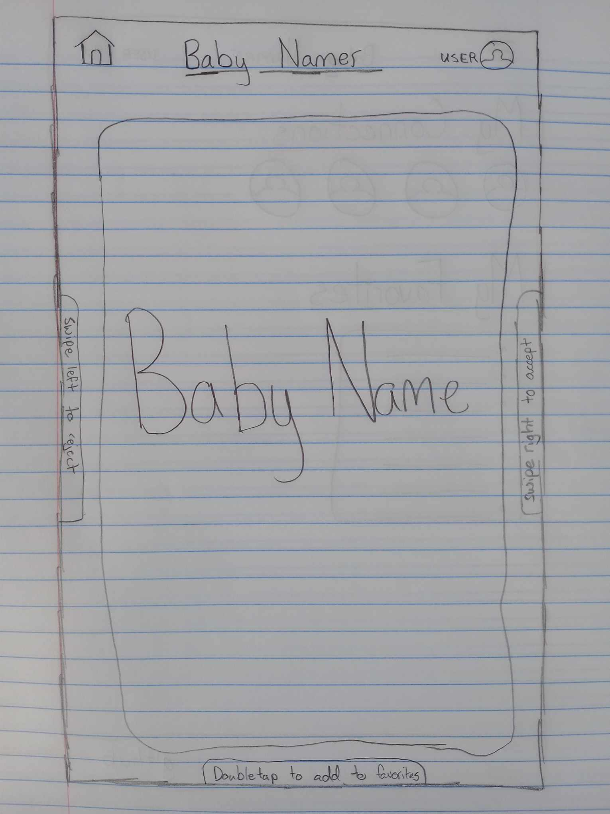
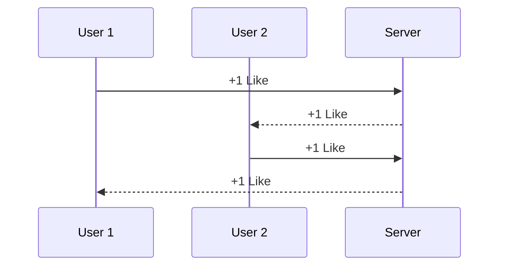

# Baby Namer

[My Notes](notes.md)

This application serves as a way for couples and families to easily choose a baby name to give to their child soon to be. 

> [!NOTE]
>  This is a template for your startup application. You must modify this `README.md` file for each phase of your development. You only need to fill in the section for each deliverable when that deliverable is submitted in Canvas. Without completing the section for a deliverable, the TA will not know what to look for when grading your submission. Feel free to add additional information to each deliverable description, but make sure you at least have the list of rubric items and a description of what you did for each item.

> [!NOTE]
>  If you are not familiar with Markdown then you should review the [documentation](https://docs.github.com/en/get-started/writing-on-github/getting-started-with-writing-and-formatting-on-github/basic-writing-and-formatting-syntax) before continuing.

## 🚀 Specification Deliverable

> [!NOTE]
>  Fill in this sections as the submission artifact for this deliverable. You can refer to this [example](https://github.com/webprogramming260/startup-example/blob/main/README.md) for inspiration.

For this deliverable I did the following. I checked the box `[x]` and added a description for things I completed.

- [X] Proper use of Markdown: *I learned how Markdown works and used it appropriately.*
- [X] A concise and compelling elevator pitch: *I tried my best to come up with a compelling pitch for my intended audience.*
- [X] Description of key features: *Completed!*
- [X] Description of how you will use each technology: *I'm not super familiar with all the technologies, but I did my best with this.*
- [X] One or more rough sketches of your application. Images must be embedded in this file using Markdown image references: *Completed!*

### Elevator pitch

What's in a name? **Everything!** With such an important decision riding on soon-to-be parents, stress can be high. Especially when everyone and their dog has an opinion about which name is best. The Baby Namer simplifies that decision for couples and families in a fun and easy way. The Baby Namer allows couples to log in and flip through baby names on their phone, select the ones they like, and then see the ones both chose. Additionally, couples have the option of adding family members to also contribute in the naming process and choose the names they like. Finally, couples can hear the feedback from loved ones without offending someone because "no one chose great aunt Sally's favorite name." End the needless frustration of choosing a name and have some fun!

### Design

Here is the Design of the main page of my application.

This will be what it looks like as you choose names.

Here is a sequence diagram to illustrate how the backend will work when you accept or like a name.

### Key features

- Choose baby names you like and don't like
- Secure login
- Realtime connectivity to family profiles
- Ability to view top matches
- Ability to see favorite names

### Technologies

I am going to use the required technologies in the following ways.

- **HTML** - I will have 2 html pages. One to view all connections, and the other to scroll through names.
- **CSS** - All the application styling to make this app look appealing.
- **React** - Provide login, name display, accepting or rejecting, and adding name to favourites.
- **Service** - Backend Service with endpoints for:
  - login
  - retrieving names
  - submitting preferences
- **DB/Login** - Register and login users. Will store name preferences.
- **WebSocket** - Will Update matches and display that for couples.

## 🚀 AWS deliverable

For this deliverable I did the following. I checked the box `[x]` and added a description for things I completed.

- [X] **Server deployed and accessible with custom domain name** - [Baby Namer Startup](https://260-baby-namer.click).

## 🚀 HTML deliverable

For this deliverable I did the following. I checked the box `[x]` and added a description for things I completed.

- [ ] **HTML pages** - I did not complete this part of the deliverable.
- [ ] **Proper HTML element usage** - I did not complete this part of the deliverable.
- [ ] **Links** - I did not complete this part of the deliverable.
- [ ] **Text** - I did not complete this part of the deliverable.
- [ ] **3rd party API placeholder** - I did not complete this part of the deliverable.
- [ ] **Images** - I did not complete this part of the deliverable.
- [ ] **Login placeholder** - I did not complete this part of the deliverable.
- [ ] **DB data placeholder** - I did not complete this part of the deliverable.
- [ ] **WebSocket placeholder** - I did not complete this part of the deliverable.

## 🚀 CSS deliverable

For this deliverable I did the following. I checked the box `[x]` and added a description for things I completed.

- [ ] **Header, footer, and main content body** - I did not complete this part of the deliverable.
- [ ] **Navigation elements** - I did not complete this part of the deliverable.
- [ ] **Responsive to window resizing** - I did not complete this part of the deliverable.
- [ ] **Application elements** - I did not complete this part of the deliverable.
- [ ] **Application text content** - I did not complete this part of the deliverable.
- [ ] **Application images** - I did not complete this part of the deliverable.

## 🚀 React part 1: Routing deliverable

For this deliverable I did the following. I checked the box `[x]` and added a description for things I completed.

- [ ] **Bundled using Vite** - I did not complete this part of the deliverable.
- [ ] **Components** - I did not complete this part of the deliverable.
- [ ] **Router** - Routing between login and voting components.

## 🚀 React part 2: Reactivity

For this deliverable I did the following. I checked the box `[x]` and added a description for things I completed.

- [ ] **All functionality implemented or mocked out** - I did not complete this part of the deliverable.
- [ ] **Hooks** - I did not complete this part of the deliverable.

## 🚀 Service deliverable

For this deliverable I did the following. I checked the box `[x]` and added a description for things I completed.

- [ ] **Node.js/Express HTTP service** - I did not complete this part of the deliverable.
- [ ] **Static middleware for frontend** - I did not complete this part of the deliverable.
- [ ] **Calls to third party endpoints** - I did not complete this part of the deliverable.
- [ ] **Backend service endpoints** - I did not complete this part of the deliverable.
- [ ] **Frontend calls service endpoints** - I did not complete this part of the deliverable.

## 🚀 DB/Login deliverable

For this deliverable I did the following. I checked the box `[x]` and added a description for things I completed.

- [ ] **User registration** - I did not complete this part of the deliverable.
- [ ] **User login and logout** - I did not complete this part of the deliverable.
- [ ] **Stores data in MongoDB** - I did not complete this part of the deliverable.
- [ ] **Stores credentials in MongoDB** - I did not complete this part of the deliverable.
- [ ] **Restricts functionality based on authentication** - I did not complete this part of the deliverable.

## 🚀 WebSocket deliverable

For this deliverable I did the following. I checked the box `[x]` and added a description for things I completed.

- [ ] **Backend listens for WebSocket connection** - I did not complete this part of the deliverable.
- [ ] **Frontend makes WebSocket connection** - I did not complete this part of the deliverable.
- [ ] **Data sent over WebSocket connection** - I did not complete this part of the deliverable.
- [ ] **WebSocket data displayed** - I did not complete this part of the deliverable.
- [ ] **Application is fully functional** - I did not complete this part of the deliverable.
